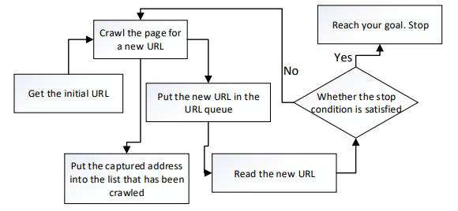

# Web Crawler

## Basic Principle

Crawlers mainly include ***downloaders***, ***information extractors***, ***schedulers*** and ***crawl queues***:
- **Scheduler**: seeds URL provided to download.
- **Downloader**: gets page information from the Internet and send to informtion extractor, according to the instruction based on the extracting strategy.
- **Information Extractor**: determines the extracting strategy, receives and extracts the information and the next level URLs.
- **Crawl Queue**: contains URLs waiting to be called by the scheduler.

## Classification of Crawlers
1. **Generic Crawler**
- aka *`traditional crawler`*.
- Grabs all documents and links related.
- Usually runs for a long time and consumes a lot of disk space.

2. **Focus Crawler**
- aka *`topic crawler`*.
- Only crawl specific web pages, which can save time, disk space and network resources.
- Difference between focus crawler & general crawler lies in 2 modules to filter web links: ***Web page judgement module*** and ***URL priority ranking module***

3. **Incremental Crawler**
- Uses different strategy to update data when crawl pages.
- When it needs to re-crawl the page for updates, instead of travere through all links in the network, it marks only the pages that are expired. The crawler then only crawls the marked pages.
- Incremental crawling can be used in these following situations:
  - websites with new pages or daily news.
  - websites where page content will be updated.
  - determine if the content already exists in the DB.

4. **Distributed Crawler**
- Runs on a group of computers, each of which runs a focused crawler.
- Can be divided into 3 types:
  - ***master/slave***: is hosted by 1 machine (master) ans controls the operation of the whole group. The host manages the list of URLs to be crawled, issues tasks and monitors work status for each slave.
  - ***autonomous***: has no control host, it operates normally through the communication between each machine. There are 2 forms of communication: **circular communication** - 1-way transmission through a circle of machine; and **unicom communication** - each machine has to communicate with all other machines.
  - ***mixed*** (= ***master/slave*** + ***autonomous***): has a host in charge of task assignment, but slave machines can communicate with each other and have their own task assignment function. The host only assign task to slave if the slave faild its own task.

## Web Crawling vs Web Scraping
1. Web Crawling

- aka *`Indexing`*
- It goes through every page and every link, until the last line of the website, looking for more links in each page and continue crawling for any kind of information.
- Benefits:
  - Deep dive
  - Real-time

2. Web Scraping 

- similar to web crawling BUT web scrapers only extract information that satisfies specific conditions
- Benefits:
  - Highly accurate
  - Cost-efficient